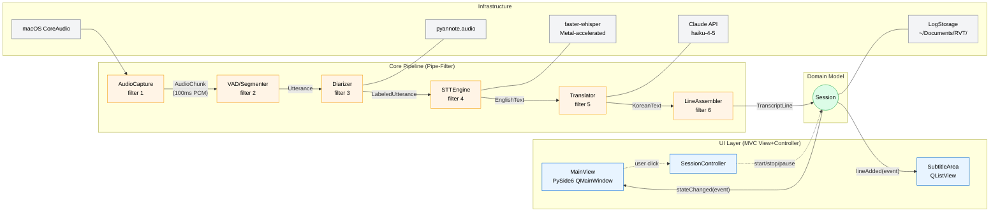

# 소프트웨어 설계 명세서 (SDD)

> **Real-time Voice Translator (RVT) — Software Design Description**
> 본 문서는 강의록 06_설계원리 + 07_아키텍처와 패턴을 적용한 설계 명세이다.
> 강의록 06 §6.1 "설계 = '어떻게 실현할 것인가'" — 즉, SRS의 "무엇"을 "어떻게"로 구체화.
> 모든 설계 결정은 [`../requirements/SRS.md`](../requirements/SRS.md), [`../requirements/USECASES.md`](../requirements/USECASES.md), [`../requirements/DOMAIN_MODEL.md`](../requirements/DOMAIN_MODEL.md)에서 추적 가능하다.

| 메타 | 값 |
|---|---|
| 문서 ID | RVT-SDD |
| 버전 | 0.1 (Day 4 — 아키텍처 중심) |
| 작성일 | 2026-05-27 |
| 작성자 | ghwo336 |
| 후속 | Day 5에 UI 설계 추가 → v1.0 |

---

## 1. 설계 관점 (강의록 06 §6.1)

본 문서는 강의록 06 슬라이드 7의 3가지 설계 관점 중 다음을 다룬다.

| 관점 | Day 4 (본 문서 v0.1) | Day 5 (v1.0 추가 예정) |
|---|---|---|
| **모듈 관점** | §3 | (정련) |
| **컴포넌트 관점** | §2, §4 | (UI 컴포넌트 추가) |
| **할당 관점** | §5 (배포·실행) | - |

---

## 2. 아키텍처 (강의록 07 §7.2)

### 2.1 아키텍처 스타일 선정

#### 2.1.1 후보 비교

| 스타일 | RVT 적합도 | 평가 |
|---|---|---|
| 클라이언트-서버 | ❌ | 단일 데스크탑 앱, 서버 없음 |
| 계층형 | △ | UI/Domain/Infra 계층 분리에 부분 적용 가능 |
| 이벤트 기반 | ◯ | 오디오 청크 = 이벤트 — 잘 맞음 |
| MVC | ◯ | UI 부분에 자연스러움 (Day 5) |
| **파이프-필터** | ◎ | **음성 처리 전체가 단계적 변환 파이프라인** — 강의록 07 슬라이드 10 "단순성/병렬성/재사용" 장점 일치 |
| 데이터 중심 | △ | 공유 저장소 중심 아님 |
| Peer-to-Peer | ❌ | 대칭 컴포넌트 없음 |

#### 2.1.2 선정: **파이프-필터 + 이벤트 기반 + MVC 하이브리드**

**근거**:
- **코어 음성 처리** → **파이프-필터**: 강의록 07 슬라이드 10 "필터 사이에 데이터를 이동시키며 단계적으로 처리. 장점: 단순성, 재사용, 병렬성." → RVT의 NFR-001 (지연 ≤ 3초)는 **병렬성** 직접 활용 필요.
- **컴포넌트 간 통신** → **이벤트 기반**: 강의록 07 슬라이드 8 "이벤트가 실시간으로 전달되어 발생하는 즉시 소비자가 응답" — STT 결과가 도착하는 즉시 Translator·UI가 반응해야 함.
- **UI 분리** → **MVC**: 강의록 07 슬라이드 9 "사용자 인터페이스로부터 비즈니스 로직과 데이터를 분리" — Day 5에서 상세화.

### 2.2 아키텍처 다이어그램 — 컴포넌트 뷰



### 2.3 데이터 흐름

```
[마이크 100ms 청크]
    ↓ AudioCapture (PCM float32 mono 16kHz)
[AudioChunk]
    ↓ VAD/Segmenter (silero-vad, 300ms 무음 = 발화 경계)
[Utterance (raw audio segment)]
    ↓ Diarizer (pyannote → speaker embedding → 클러스터링)
[LabeledUtterance (speaker label 부여)]
    ↓ STTEngine (faster-whisper transcribe)
[EnglishText (utterance + speaker)]
    ↓ Translator (Claude API call)
[KoreanText]
    ↓ LineAssembler (timestamp + speaker + en + ko)
[TranscriptLine] → Session.appendLine() → UI emit signal
```

---

## 3. 모듈 구조 (강의록 06 슬라이드 13 모듈화)

### 3.1 Python 패키지 구조

```
src/rvt/
├── __init__.py
├── app.py                    # 진입점 (PySide6 QApplication)
├── core/                     # 코어 파이프라인 (UI 비의존)
│   ├── __init__.py
│   ├── session.py            # Session, SessionState (상태 패턴)
│   ├── audio_capture.py      # AudioCapture (인터페이스 + macOS 구현)
│   ├── segmenter.py          # VAD/발화 분할
│   ├── diarizer.py           # Diarizer (인터페이스 + pyannote 구현)
│   ├── stt_engine.py         # STTEngine (인터페이스 + faster-whisper 구현)
│   ├── translator.py         # Translator (인터페이스 + Claude API 구현)
│   ├── assembler.py          # LineAssembler
│   ├── storage.py            # LogStorage
│   └── models.py             # Speaker, Utterance, TranscriptLine 등 데이터 클래스
├── ui/                       # UI 레이어 (MVC View/Controller) — Day 5 정련
│   ├── __init__.py
│   ├── main_view.py
│   ├── subtitle_area.py
│   ├── level_meter.py
│   └── controller.py
└── infrastructure/           # 외부 의존성 어댑터 (강의록 07 어댑터 패턴)
    ├── __init__.py
    ├── coreaudio.py          # macOS 오디오 어댑터
    └── claude_client.py      # Claude API 어댑터
```

### 3.2 응집도·결합도 자기 평가 (강의록 06 슬라이드 16-18)

| 모듈 | 응집도 | 결합도 |
|---|---|---|
| `core/session.py` | **기능적** (단일 세션 책임) | **데이터 결합** (Filter들과 데이터 객체로만 통신) |
| `core/stt_engine.py` | **기능적** (transcribe 단일 책임) | **데이터 결합** |
| `core/translator.py` | **기능적** (translate 단일 책임) | **데이터 결합** |
| `ui/main_view.py` | **교환적** (메인 화면 구성 요소 그룹화) | **데이터 결합** (signal/slot via Pydantic-like DTO) |
| `infrastructure/coreaudio.py` | **기능적** (OS API 캡슐화) | **데이터 결합** |

**결합도 등급 비교** (강의록 06 슬라이드 16): 내용 > 공통 > 제어 > 스탬프 > **데이터** (가장 약한 결합).
**응집도 등급 비교** (슬라이드 18): 우연적 < 논리적 < 시간적 < 절차적 < 교환적 < **기능적** (가장 강한 응집).

→ 본 설계는 **최적 등급 (데이터 결합 + 기능적 응집)**에 도달.

---

## 4. 동시성 모델 (NFR-001 지연 ≤ 3초 충족)

### 4.1 동시성 패턴 선정

#### 4.1.1 후보 비교

| 모델 | 장점 | 단점 | 선정 |
|---|---|---|---|
| `threading` | 간단, GIL 우회 불필요 | 콜백 헬, 디버깅 어려움 | ❌ |
| `multiprocessing` | CPU bound 회피, 진정한 병렬 | IPC 비용, GUI 통합 복잡 | ❌ |
| **`asyncio`** | **I/O bound에 최적, 코루틴 가독성** | CPU bound는 별도 처리 필요 | ✅ |
| `asyncio` + `ThreadPoolExecutor` | asyncio + 무거운 작업(Whisper inference) 격리 | 약간의 복잡도 증가 | ✅ |

**선정**: `asyncio` 메인 루프 + **`run_in_executor()`로 Whisper/pyannote 추론 격리**

#### 4.1.2 근거
- 번역(Claude API)·저장 = **I/O bound** → 코루틴 자연스러움
- Whisper inference = **CPU/GPU bound** → executor로 격리해야 이벤트 루프 안 막힘
- PySide6는 `qasync` 라이브러리로 asyncio와 통합 가능 → UI 응답성 유지

### 4.2 파이프라인 큐 구조

```
AudioCapture ──→ chunk_queue (asyncio.Queue, maxsize=50)
                    ↓
                 Segmenter (consumer task)
                    ↓
                 utt_queue (asyncio.Queue, maxsize=20)
                    ↓
                 Diarizer + STT (병렬 producer tasks via gather)
                    ↓
                 trans_queue (asyncio.Queue, maxsize=20)
                    ↓
                 Translator (consumer task)
                    ↓
                 UI signal emit (Qt main thread)
```

**maxsize 설계 이유 — 백프레셔 (Backpressure)**:
- `chunk_queue` maxsize=50 → 100ms × 50 = 5초 분량 버퍼링. 그 이상이면 STT가 못 따라가는 것으로 판단, 사용자에게 경고.
- `utt_queue` maxsize=20 → 평균 5초 발화 기준 100초 분량. 충분한 여유.
- 큐가 꽉 차면 `put()`이 `await`로 블록되어 자연스럽게 백프레셔 적용.

### 4.3 예외 처리 정책 (FR-009, UC-07)

- 각 filter task는 `try/except` + 자체 재시도 (지수 백오프 5s, 10s, 20s)
- 3회 연속 실패 시 `Session.state = DEGRADED` 전환 (신규 상태) + UI 경고
- 한 filter의 실패가 다른 filter를 멈추지 않음 (NFR-005 신뢰성)

---

## 5. 디자인 패턴 적용 (강의록 07 §7.3)

| 강의록 패턴 | 적용 위치 | 목적 |
|---|---|---|
| **전략 (Strategy)** | `STTEngine`, `Translator`, `Diarizer` 인터페이스 | 구체 엔진(faster-whisper / Claude / pyannote)을 런타임 교체 가능. Open Issues 변경 시 코어 코드 무수정 |
| **팩토리 메소드 (Factory Method)** | `EngineFactory.create_stt(name)` | 설정 파일 기반 엔진 인스턴스 생성 |
| **어댑터 (Adapter)** | `infrastructure/coreaudio.py`, `claude_client.py` | OS/SDK 인터페이스를 도메인 인터페이스에 적합화 |
| **상태 (State)** | `Session.state` (`IDLE / RUNNING / PAUSED / DEGRADED`) | 상태별 허용 동작 분리, 강의록 07 슬라이드 47 "상태에 따라 객체의 동작을 변경" |
| **옵서버 (Observer)** | `Session.lineAdded` Qt signal → `SubtitleArea`, `LogStorage` | 강의록 07 슬라이드 63 "Subject가 옵서버와 효과적 통신, 느슨 결합" |
| **싱글톤 (Singleton)** | `EngineFactory`, `Config` | 모델 로딩 비용이 커서 단일 인스턴스 보장 |

### 5.1 SOLID 자기 점검 (강의록 06 §6.4)

| 원리 | 적용 |
|---|---|
| **SRP** 단일 책임 | 각 filter 모듈이 변환 단계 하나만 담당 (§3.2 기능적 응집) |
| **OCP** 개방-폐쇄 | 새 STT 엔진 추가 시 `STTEngine` 구현체 추가만 — 코어 무수정 |
| **LSP** 리스코프 | `STTEngine` 인터페이스 계약(`transcribe(utt) → str`) — 모든 구현체 동일 동작 |
| **ISP** 인터페이스 분리 | `STTEngine`/`Translator`/`Diarizer`/`LogStorage` 분리 — 사용자가 필요한 인터페이스만 의존 |
| **DIP** 의존 역전 | `Session`은 구체 라이브러리(faster-whisper)에 의존하지 않고 `STTEngine` 추상에 의존 |

---

## 6. 기술 스택 (Open Issues O-01 ~ O-04 해소)

| ID | 결정 | 버전 | 비고 |
|---|---|---|---|
| **O-01 STT** | `faster-whisper` | medium / large-v3 (사용자 선택) | Apple Silicon Metal 가속, 비용 0, 오프라인 |
| **O-02 번역** | `Claude API` (Anthropic) | claude-haiku-4-5-20251001 | 회의 맥락 이해 우수, 1세션 ≈ ₩50 |
| **O-03 화자분리** | `pyannote.audio` 3.1 + 에너지 fallback | 3.1 | Risk R2: Sprint 1에서 성능 미달 시 fallback |
| **O-04 UI** | `PySide6` (Qt for Python) | 6.6+ | Mac 네이티브, signal/slot = 옵서버 패턴 |

**부가 라이브러리**:
| 라이브러리 | 용도 | 버전 |
|---|---|---|
| `numpy` | 오디오 버퍼 처리 | 1.26+ |
| `sounddevice` | macOS CoreAudio 래퍼 | 0.4.6+ |
| `silero-vad` | 무음 감지 (Segmenter) | 4.0+ |
| `qasync` | PySide6 ↔ asyncio 통합 | 0.27+ |
| `anthropic` | Claude API 공식 SDK | 최신 |
| `pytest`, `pytest-asyncio` | 테스트 | 최신 |
| `pydantic` | DTO 검증 | 2.x |

---

## 7. 할당 관점 (강의록 06 슬라이드 7)

### 7.1 런타임 배치

```
┌─────────────────────────────────────────────────┐
│  RVT.app (macOS Application Bundle)             │
│  ┌───────────────────────────────────────────┐  │
│  │ Python 3.11 runtime (PyInstaller frozen) │  │
│  │  ├── faster-whisper (CTranslate2 + Metal) │  │
│  │  ├── pyannote.audio (PyTorch + MPS)       │  │
│  │  └── PySide6                               │  │
│  └───────────────────────────────────────────┘  │
└─────────────────────────────────────────────────┘
       │                          │
       ▼                          ▼
[macOS CoreAudio]          [Claude API]
[~/Documents/RVT/]         (HTTPS, anthropic.com)
```

### 7.2 자원 사용 예측 (NFR-007 검증 가능성)

| 자원 | 예측 | 측정 시점 |
|---|---|---|
| CPU (회의 중 평균) | ≤ 50% (Apple M2 기준) | 통합 테스트 Day 11 |
| 메모리 (Whisper-medium 로딩 후) | ≈ 1.5GB | 시작 직후 |
| 디스크 (모델 캐시) | ≈ 2GB (medium) / 6GB (large) | 첫 다운로드 |
| 네트워크 (번역 API) | ≈ 1KB / 발화 | 회의 중 |

---

## 8. SDD ↔ SRS / UC 추적성 (강의록 04 §4.3, 06 §6.1)

| SRS 요구 | SDD 컴포넌트 / 결정 |
|---|---|
| FR-001 (오디오 캡처) | `AudioCapture` + `infrastructure/coreaudio.py` |
| FR-002 (STT) | `STTEngine` (faster-whisper) |
| FR-003 (번역) | `Translator` (Claude API) |
| FR-004 (화자 분리) | `Diarizer` (pyannote + fallback) |
| FR-005 (라벨 일관성) | `Diarizer` 내부에 세션 단위 화자 임베딩 캐시 |
| FR-006 (자동 저장) | `LogStorage` + `Session.stop()` |
| FR-007 (로그 포맷) | `TranscriptLine.format()` |
| FR-008 (입력 검증) | `AudioCapture.listDevices()` + UI `LevelMeter` |
| FR-009 (오류 통지) | §4.3 예외 처리 정책 |
| FR-010 (세션 제어) | `Session` (State 패턴) |
| NFR-001 (지연) | §4 비동기 파이프라인 + 병렬 큐 |
| NFR-002 (번역 정확도) | O-02 Claude API 선택 근거 |
| NFR-003 (STT 정확도) | O-01 faster-whisper medium/large 선택. 사용자가 모델 크기 트레이드오프 선택 가능 (정확도↑/지연↑) |
| NFR-004 (사용성) | UI 단순화 (메인 화면에 디바이스 선택 + 시작/종료 1단계). 상세 UI 명세는 Day 5 v1.0에서 정련 |
| NFR-005 (신뢰성) | §4.3 filter 격리, fallback |
| NFR-006 (플랫폼 통합) | PySide6 + sounddevice |
| NFR-007 (자원) | §7.2 예측치 |
| NFR-008 (프라이버시) | 로컬 STT (faster-whisper) — 음성 외부 전송 없음. 번역만 외부 (텍스트). |

**역방향**: 모든 SRS 요구가 위 표에 1회 이상 등장 ✅

---

## 9. 후속 (Day 5 v1.0에서 추가)

- 강의록 08_UI 설계 분석
- `ui/` 하위 컴포넌트 상세 명세 (MainView, SubtitleArea, LevelMeter)
- UI 와이어프레임 (Mermaid 또는 ASCII)
- 사용자 인터랙션 상태도 (강의록 05 §5.4 상태 다이어그램)
- 색상·키보드 단축키 명세

---

## 변경 이력

| 버전 | 날짜 | 변경 내용 | 작성자 |
|---|---|---|---|
| 0.1 | 2026-05-27 | 최초 초안 — 아키텍처(파이프-필터+이벤트+MVC), 모듈 구조, 동시성(asyncio), 6개 디자인 패턴 적용, 기술 스택 확정, SOLID 점검, SDD↔SRS 추적 | ghwo336 |
| _(예정) 1.0_ | _2026-05-28_ | _UI 설계 추가 (강의록 08)_ | _ghwo336_ |
