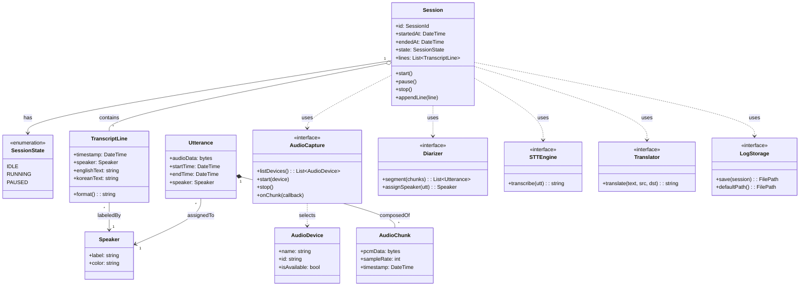
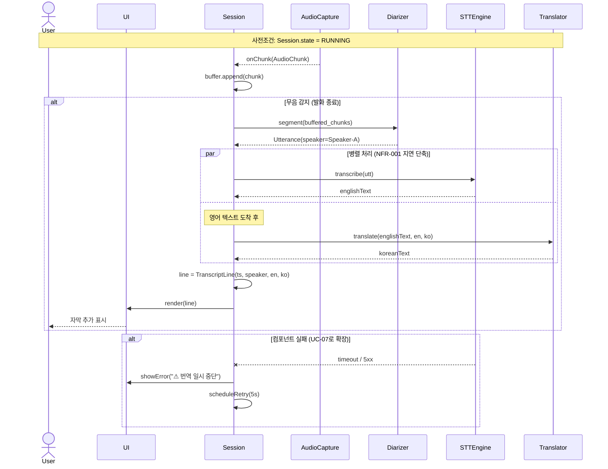

# 도메인 모델 — 클래스 + 시퀀스 다이어그램

> 본 문서는 강의록 05 §5.3 정적 모델링과 §5.4 동적 모델링을 적용한 **요구 단계의 도메인 모델**이다.
> ⚠ 이 모델은 "요구사항 분석" 단계의 산출물이며, **설계 상세(상세 클래스, 메서드 시그니처, 외부 라이브러리 결합)는 Day 4-5 SDD에서 정련된다** (강의록 05 §5.1 "표현 수준 — 모델링이 진행되면서 상세화").

| 메타 | 값 |
|---|---|
| 문서 ID | RVT-DOMAIN |
| 버전 | 1.0 |
| 작성일 | 2026-05-26 |
| 추상화 수준 | 도메인 / 개념적 (Day 4-5에 설계 수준으로 상세화) |

---

## 1. 도메인 객체 후보 식별

### 1.1 식별 방법 (강의록 05 §5.2 UML 모델링 과정 ② "클래스 후보를 찾아내고")

요구사항 명세서와 시나리오의 **명사**에서 클래스 후보 추출:

| 명사 (출처) | 클래스 후보 여부 | 비고 |
|---|---|---|
| 세션 (UC-01, UC-03) | ✅ Session | 시작~종료의 단일 단위 |
| 발화 (정의 §1.3) | ✅ Utterance | 무음으로 끊긴 한 단위 |
| 화자 (FR-004, FR-005) | ✅ Speaker | 라벨 부여 단위 |
| 자막 라인 (FR-007) | ✅ TranscriptLine | 화자+영어+번역+타임스탬프 묶음 |
| 오디오 청크 (NFR-001) | ✅ AudioChunk | STT 입력 단위 |
| 오디오 캡처 (FR-001) | ✅ AudioCapture | OS와의 경계 컴포넌트 |
| STT 엔진 (FR-002) | ✅ STTEngine | 외부 시스템 추상화 |
| 번역 엔진 (FR-003) | ✅ Translator | 외부 시스템 추상화 |
| 화자 분리기 (FR-004) | ✅ Diarizer | 단일 책임 컴포넌트 |
| 로그 저장소 (FR-006) | ✅ LogStorage | 파일 시스템 경계 |
| 입력 디바이스 (UC-04) | ✅ AudioDevice | 값 객체 |
| 회의/미팅 | ❌ | "세션"으로 추상화됨 (중복) |
| 사용자 | ❌ | 액터지 도메인 객체 아님 |
| 마이크 | ❌ | AudioDevice의 한 종류로 포함됨 |

---

## 2. 클래스 다이어그램 (Mermaid)

### 2.1 관계 설명 (강의록 05 §5.3 슬라이드 21)

- **`Session` ◇—— `TranscriptLine`** (집합/aggregation): 세션이 종료돼도 라인 객체는 의미상 독립적으로 직렬화 가능.
- **`Utterance` ◆—— `AudioChunk`** (합성/composition): 발화가 사라지면 청크도 의미를 잃음.
- **`Session` ··> Interface들** (의존/dependency): 세션은 외부 컴포넌트의 구체 구현에 직접 의존하지 않고 인터페이스에 의존 → 의존성 역전 원칙. Day 4 설계에서 구체 구현체(Whisper / DeepL 등)는 주입 방식 결정 예정.
- **`<<interface>>`** 표시된 클래스는 강의록 05 §5.3 슬라이드 19 "추상클래스는 이탤릭체, 인터페이스 클래스는 `<<interface>>`" 표기 준수.

### 2.2 캡슐화 (강의록 05 슬라이드 15)

- 외부 시스템(STT, 번역, 오디오 OS API)은 모두 `<<interface>>`로 캡슐화하여 정보은닉 적용.
- 이로써 Day 4 기술 스택 결정(Open Issues O-01 ~ O-04)에서 어떤 구체 구현을 선택해도 `Session`의 코드는 변경되지 않는다.

---

## 3. 시퀀스 다이어그램 — UC-02 실시간 자막 한 라인 (S-01 핵심 흐름)

> 강의록 05 §5.4 슬라이드 26 작성 과정: ① 참여 객체 파악 → ② X축 배치 → ③ 메시지 순서대로 화살표

### 3.1 참여 객체

User, Session, AudioCapture, Diarizer, STTEngine, Translator, TranscriptLine, UI

### 3.2 다이어그램

### 3.3 흐름 해설

1. `AudioCapture`가 OS로부터 100ms 청크를 받아 `Session`에 비동기 콜백.
2. `Session`은 청크를 버퍼링하며 무음 감지로 발화 경계 결정.
3. 발화 단위가 완성되면 `Diarizer`가 화자 라벨 부여.
4. **STT와 번역은 순차적이지만 다음 발화 처리와는 병렬** — NFR-001 (지연 ≤ 3초) 만족을 위한 파이프라인 설계 의도.
5. 두 응답이 모이면 `TranscriptLine` 생성 후 `UI`에 즉시 렌더.
6. 예외 경로(UC-07): STT/번역 실패 시 UI에 오류 표시, 5초 후 자동 재시도.

---

## 4. 클래스 ↔ 시퀀스 일관성 점검 (강의록 05 §5.6 슬라이드 33)

> "시퀀스 다이어그램 안에 포함된 클래스와 메시지가 클래스 다이어그램에 빠지지 않고 표현되었는지 체크"

| 시퀀스에 등장 | 클래스 다이어그램에 정의 | 메시지 매핑 |
|---|---|---|
| Session | ✅ Session | start/pause/stop/appendLine |
| AudioCapture | ✅ AudioCapture | onChunk(callback) |
| Diarizer | ✅ Diarizer | segment(chunks), assignSpeaker(utt) |
| STTEngine | ✅ STTEngine | transcribe(utt) |
| Translator | ✅ Translator | translate(text, src, dst) |
| TranscriptLine | ✅ TranscriptLine | (생성자) |
| UI | ⚠ 클래스 다이어그램에 미정의 | **Day 4 UI 설계 단계에서 정의 예정** (강의록 08) |

UI는 의도적으로 도메인 모델에서 제외했다 — 강의록 06의 관심사 분리 원칙(Day 4에서 다룸). Day 4 UI 설계에서 `MainView`, `SubtitleArea`, `LevelMeter` 등 구체 컴포넌트로 분리될 예정.

---

## 5. 후속 정련 항목 (Day 4-5 SDD에서 다룸)

| 항목 | 처리 시점 |
|---|---|
| 각 인터페이스의 구체 구현체 선택 (Whisper/DeepL/pyannote 등) | Day 4 |
| `Session` 내부의 동시성 모델 (async/await, threads, etc.) | Day 4 |
| 버퍼링 전략 + 무음 감지 알고리즘 상세 | Day 4 |
| 화자 색상 배정 알고리즘 | Day 5 (UI 설계) |
| 예외 분류 체계 + 재시도 백오프 정책 | Day 5 |

---

## 변경 이력

| 버전 | 날짜 | 변경 내용 | 작성자 |
|---|---|---|---|
| 1.0 | 2026-05-26 | 최초 작성 — 클래스 11종, 시퀀스 1건, 일관성 점검 | ghwo336 |
