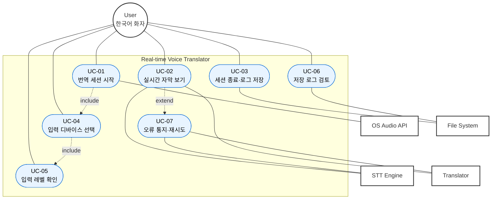

# 유스케이스 명세 (Use Cases)

> 본 문서는 강의록 04 §4.4 "유스케이스"와 05 §5.2 "UML"의 유스케이스 다이어그램 작성 절차를 따른다.
> 절차: ① 액터 찾기 → ② 유스케이스 찾기 → ③ 유스케이스 사이의 관계 찾기 (강의록 04 슬라이드 20)
> 모든 UC는 [`SRS.md`](SRS.md)의 FR과 양방향 매핑되고, [`USER_SCENARIOS.md`](USER_SCENARIOS.md)에서 도출된다.

| 메타 | 값 |
|---|---|
| 문서 ID | RVT-UC |
| 버전 | 1.0 |
| 작성일 | 2026-05-26 |
| 작성자 | ghwo336 |

---

## 1. 액터 식별 (Actor Identification)

강의록 04 슬라이드 23의 액터 찾기 질문에 답하는 방식으로 식별.

### 1.1 식별 질문 및 답변

| 질문 (강의록 04 §4.4) | 답변 |
|---|---|
| 어떤 사용자 그룹이 시스템의 주요 기능을 사용하는가? | **사용자 (User)** — 영어 회의에 참여하는 한국어 화자 |
| 어떤 사용자 그룹이 유지/관리 등 부수적 기능을 사용하는가? | 본 버전에는 없음 (관리 기능 자체가 없음) |
| 시스템이 다른 외부 하드웨어/소프트웨어와 동작하는가? | **OS 오디오 API**, **STT 엔진**, **번역 엔진**, **로컬 파일 시스템** |

### 1.2 액터 정의

| 액터 | 종류 | 설명 |
|---|---|---|
| **User** | Primary (인간) | 앱을 실행하고 회의에 참여하는 한국어 모국어 화자 |
| **OS Audio API** | Secondary (외부 시스템) | macOS CoreAudio를 통해 마이크/가상 오디오 입력 제공 |
| **STT Engine** | Secondary (외부 시스템) | 영어 음성을 텍스트로 변환 (Whisper 로컬 또는 클라우드 API — Day 4 결정) |
| **Translator** | Secondary (외부 시스템) | 영→한 번역 수행 |
| **File System** | Secondary (외부 시스템) | 세션 로그 파일 저장 |

---

## 2. 유스케이스 식별

강의록 04 슬라이드 25의 질문 적용:

| 질문 | 도출된 UC |
|---|---|
| 어떤 작업을 수행하기를 액터가 원하는가? | UC-01 (세션 시작), UC-02 (실시간 자막), UC-03 (세션 종료/저장) |
| 액터가 원하는 정보는? | UC-02 (자막), UC-06 (로그 파일) |
| 누가 데이터를 생성하는가? 조작·삭제는? | UC-03이 로그를 생성, 사용자가 파일을 직접 관리 |
| 액터가 시스템에 정보를 알리는 데 필요한 것은? | UC-04 (입력 디바이스 선택) |
| 시스템에서 정보를 알아내는 이벤트는? | UC-05 (오디오 레벨 미터), UC-07 (오류 통지) |

### 2.1 유스케이스 목록

| ID | 유스케이스 | 주 액터 | SRS FR 매핑 | 시나리오 출처 |
|---|---|---|---|---|
| UC-01 | 번역 세션 시작 | User | FR-001, FR-008, FR-010 | S-01, S-03 |
| UC-02 | 실시간 자막 보기 | User | FR-002, FR-003, FR-004, FR-005 | S-01 |
| UC-03 | 번역 세션 종료 및 로그 저장 | User | FR-006, FR-007, FR-010 | S-02 |
| UC-04 | 오디오 입력 디바이스 선택 | User | FR-008 | S-03 |
| UC-05 | 오디오 입력 레벨 확인 | User | FR-008 | S-03 |
| UC-06 | 저장된 로그 파일 검토 | User | FR-006, FR-007 | S-02 |
| UC-07 | 컴포넌트 오류 통지 및 자동 재시도 | System (자동) | FR-009 | S-04 |

---

## 3. 유스케이스 다이어그램 (Mermaid)

### 3.1 관계 설명 (강의록 04 §4.4 슬라이드 27-29)

- **`UC-01 ─include→ UC-04`**: 세션을 시작하려면 반드시 입력 디바이스 선택이 선행되어야 한다 (포함 관계).
- **`UC-04 ─include→ UC-05`**: 디바이스를 선택하면 자동으로 레벨 미터가 활성화된다.
- **`UC-02 ─extend→ UC-07`**: 정상 흐름은 UC-02만으로 완전하다. 단, 컴포넌트 오류 조건이 만족되면 UC-07이 확장 삽입된다.

---

## 4. 유스케이스 명세 (Use Case Specifications)

> 강의록 04 슬라이드 26 "유스케이스 명세" 양식 적용.

### UC-01 번역 세션 시작

| 항목 | 내용 |
|---|---|
| **ID / 이름** | UC-01 / 번역 세션 시작 |
| **주 액터** | User |
| **2차 액터** | OS Audio API |
| **사전조건** | 앱이 실행되어 메인 화면이 보임 |
| **사후조건** | 세션 상태가 `RUNNING`이 되고 자막 영역이 활성화됨 |
| **트리거** | 사용자가 "시작" 버튼을 클릭 |
| **기본 흐름** | 1. 시스템은 선택된 입력 디바이스에서 신호가 감지되는지 확인 (UC-04, UC-05 포함) 2. 신호가 감지되면 "시작" 버튼이 활성 상태임 3. 사용자가 버튼 클릭 4. 시스템은 OS Audio API에 캡처 시작을 요청 5. 시스템 상태를 `RUNNING`으로 전환하고 자막 영역을 활성화 |
| **대안 흐름** | 3a. 입력 신호 없음 → "시작" 버튼 비활성, 안내 메시지 표시 |
| **예외 흐름** | 4a. OS가 마이크 권한 거부 → 권한 요청 다이얼로그 → 거부 시 종료 (NFR-006) |
| **관련 FR** | FR-001, FR-008, FR-010 |

### UC-02 실시간 자막 보기

| 항목 | 내용 |
|---|---|
| **ID / 이름** | UC-02 / 실시간 자막 보기 |
| **주 액터** | User |
| **2차 액터** | STT Engine, Translator |
| **사전조건** | UC-01 완료, 상태 = `RUNNING` |
| **사후조건** | 자막 영역에 새로운 발화 라인 추가 |
| **트리거** | 마이크에서 발화 감지 |
| **기본 흐름** | 1. 시스템은 오디오 청크를 누적해 발화 단위로 분할 2. 각 발화에 화자 라벨을 부여 (Speaker-A, B, …) 3. STT Engine에 영어 오디오 → 영어 텍스트 변환 요청 4. Translator에 영어 텍스트 → 한국어 번역 요청 5. 자막 영역에 `[hh:mm:ss] Speaker-X: 영어 / 한국어` 형태 추가 |
| **대안 흐름** | 2a. 동일 화자의 연속 발화 → 같은 라벨 유지 (FR-005) |
| **예외 흐름** | 3a/4a. STT 또는 번역 실패 → UC-07로 확장 |
| **관련 FR** | FR-002, FR-003, FR-004, FR-005 |

### UC-03 번역 세션 종료 및 로그 저장

| 항목 | 내용 |
|---|---|
| **ID / 이름** | UC-03 / 번역 세션 종료 및 로그 저장 |
| **주 액터** | User |
| **2차 액터** | File System |
| **사전조건** | 상태 = `RUNNING` 또는 `PAUSED` |
| **사후조건** | 상태 = `IDLE`, 로그 파일이 디스크에 존재 |
| **트리거** | 사용자가 "종료" 버튼 클릭 |
| **기본 흐름** | 1. 시스템은 남은 오디오 버퍼 처리 완료를 대기 2. 세션 동안 누적된 모든 자막 라인을 직렬화 (FR-007 포맷) 3. 기본 폴더(`~/Documents/RVT/`)에 `YYYY-MM-DD_HHMMSS.txt`로 저장 4. 상태를 `IDLE`로 전환 5. 사용자에게 저장 위치 알림 |
| **대안 흐름** | 3a. 기본 폴더 부재 → 자동 생성 5a. 저장 실패 → 사용자에게 대체 경로 선택 다이얼로그 |
| **관련 FR** | FR-006, FR-007, FR-010 |

### UC-04 오디오 입력 디바이스 선택

| 항목 | 내용 |
|---|---|
| **ID / 이름** | UC-04 / 오디오 입력 디바이스 선택 |
| **주 액터** | User |
| **2차 액터** | OS Audio API |
| **사전조건** | 앱 실행 |
| **사후조건** | 선택된 디바이스가 현재 입력 소스로 지정 |
| **트리거** | 사용자가 드롭다운 메뉴 조작 |
| **기본 흐름** | 1. 시스템은 OS Audio API에서 사용 가능 입력 디바이스 목록 조회 2. 드롭다운에 목록 표시 3. 사용자 선택 4. 선택된 디바이스를 활성 입력으로 설정 5. UC-05 자동 실행 |
| **대안 흐름** | 1a. 디바이스 없음 → 안내 메시지 + 시작 버튼 비활성 |
| **관련 FR** | FR-008 |

### UC-05 오디오 입력 레벨 확인

| 항목 | 내용 |
|---|---|
| **ID / 이름** | UC-05 / 오디오 입력 레벨 확인 |
| **주 액터** | User |
| **사전조건** | UC-04 완료 |
| **사후조건** | 신호 감지 시 "시작" 버튼 활성화 |
| **기본 흐름** | 1. 시스템은 100ms 간격으로 입력 RMS를 계산 2. 미터 UI에 시각화 3. 신호가 임계값(예: -50 dBFS)을 초과하면 "시작" 버튼 활성 |
| **관련 FR** | FR-008 |

### UC-06 저장된 로그 파일 검토

| 항목 | 내용 |
|---|---|
| **ID / 이름** | UC-06 / 저장된 로그 파일 검토 |
| **주 액터** | User |
| **2차 액터** | File System (OS 외부 도구) |
| **사전조건** | UC-03을 통해 저장된 파일이 존재 |
| **사후조건** | 사용자가 외부 텍스트 에디터로 파일 내용을 확인 |
| **기본 흐름** | 1. 사용자가 "최근 세션 열기" 메뉴 클릭 2. 시스템이 OS 기본 텍스트 에디터로 파일 열기 |
| **관련 FR** | FR-006, FR-007 |

### UC-07 컴포넌트 오류 통지 및 자동 재시도 (확장)

| 항목 | 내용 |
|---|---|
| **ID / 이름** | UC-07 / 컴포넌트 오류 통지 및 자동 재시도 |
| **주 액터** | System (자동) |
| **2차 액터** | STT Engine, Translator |
| **사전조건** | UC-02 진행 중에 컴포넌트 호출 실패 |
| **사후조건** | 자막 영역에 오류 표시, 재시도로 정상 복귀 또는 사용자 안내 |
| **트리거** | STT 또는 번역 응답 timeout / 5xx 응답 |
| **기본 흐름** | 1. 실패한 컴포넌트 식별 2. 자막 영역 상태바에 "⚠ 번역 일시 중단 — 재시도 중" 표시 3. 5초 후 자동 재시도 4. 성공 시 상태바 표시 제거, 밀린 발화부터 처리 재개 |
| **대안 흐름** | 3a. 3회 연속 실패 → "⛔ 컴포넌트 응답 없음, 입력은 계속 캡처 중" 표시 + 사용자가 수동 재시작 권장 |
| **관련 FR** | FR-009 |

---

## 5. UC ↔ FR 추적성 매트릭스

| FR | 매핑되는 UC |
|---|---|
| FR-001 (오디오 캡처) | UC-01 |
| FR-002 (STT) | UC-02 |
| FR-003 (번역) | UC-02 |
| FR-004 (화자 분리) | UC-02 |
| FR-005 (라벨 일관성) | UC-02 |
| FR-006 (자동 저장) | UC-03, UC-06 |
| FR-007 (로그 포맷) | UC-03, UC-06 |
| FR-008 (입력 검증) | UC-01, UC-04, UC-05 |
| FR-009 (오류 통지) | UC-07 |
| FR-010 (세션 제어) | UC-01, UC-03 |

**역방향 점검**:
- 모든 UC가 최소 1개 이상의 FR에 연결됨 ✅
- 모든 FR이 최소 1개 이상의 UC에 매핑됨 ✅
- 고아 요구사항 / 고아 유스케이스 없음 ✅

---

## 변경 이력

| 버전 | 날짜 | 변경 내용 | 작성자 |
|---|---|---|---|
| 1.0 | 2026-05-26 | 최초 작성 — 액터 5 / UC 7 / 다이어그램 / 명세 / 추적성 | ghwo336 |
